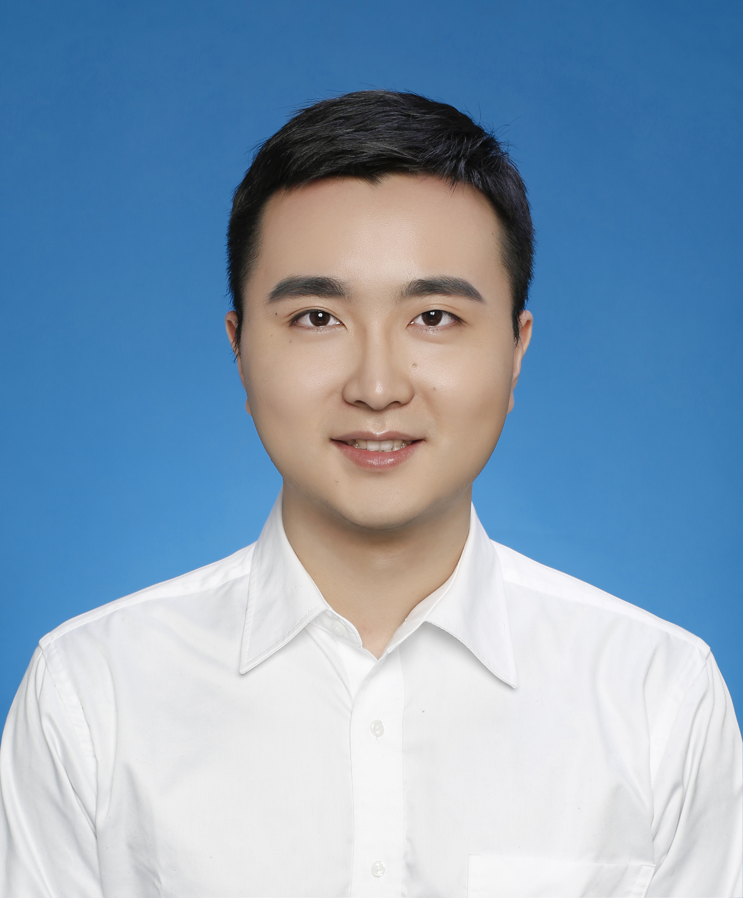
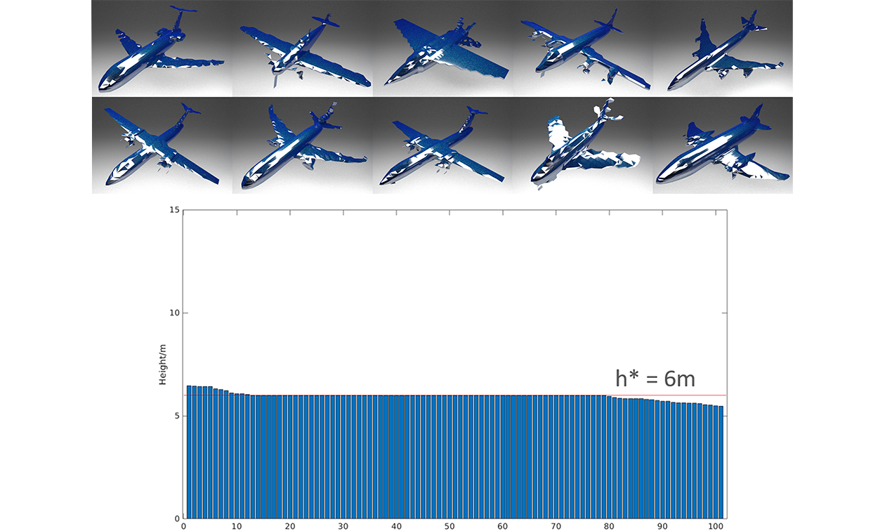
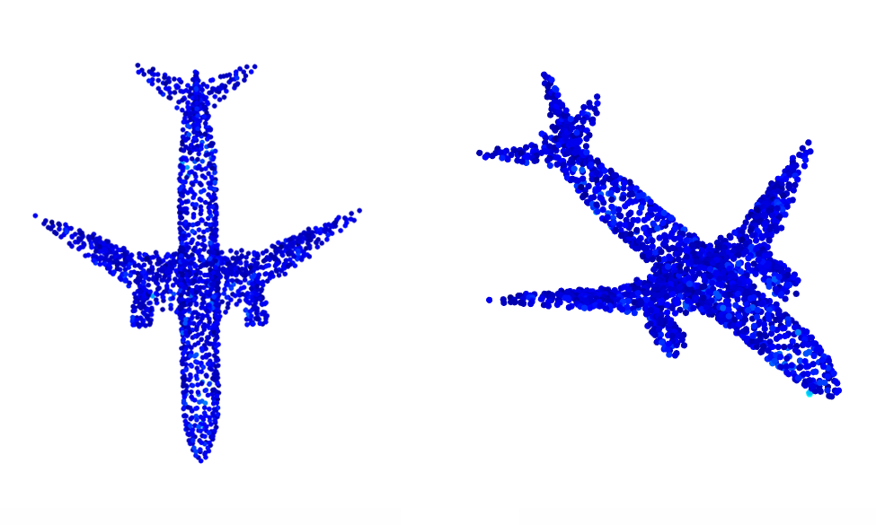
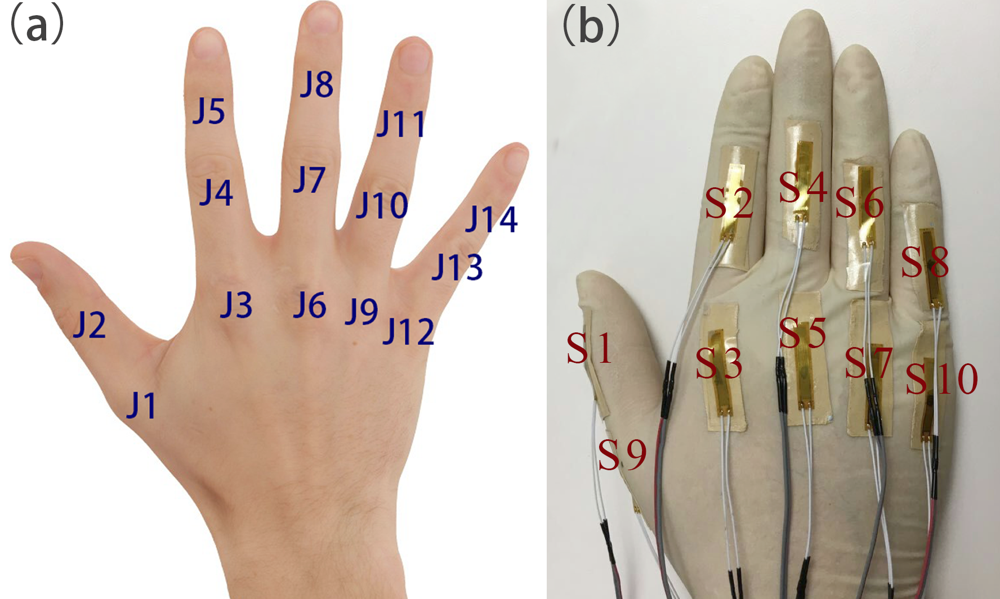

<!-- inpage jump -->
[Education](#education) &nbsp;&nbsp;[Research](#research) &nbsp;&nbsp;[Awards](#awards) 

<!-- about me -->

 
 Wentai Zhang  
 

I am a Ph.D. student at Carnegie Mellon University. My advisors are <a href="http://vdel.me.cmu.edu/" target="_blank">Prof. Levent Burak Kara</a>, <a href="http://www.andrew.cmu.edu/user/shimada/" target="_blank">Prof. Kenji Shimada</a> and <a href="http://www.cs.cmu.edu/~bapoczos/" target="_blank">Prof. Barnabas Poczos</a>.

The main focus of my research is machine learning, especially deep representation learning for 3D data, reinforcement learning and their applications in generative design and computer vision.

<!-- Education -->

<h2>Education</h2>

<table>
<tbody>
<tr>
<td colspan="3"><b>Carnegie Mellon University</b></td>
</tr>
<tr>
<td>&nbsp;Ph.D.</td>
<td>&nbsp; 3D Learning and Generative Design</td>
<td>&nbsp;   2017.08 - Present</td>
</tr>
<tr>
<td>&nbsp;M.S.</td>
<td>&nbsp; Machine Learning</td>
<td>&nbsp;   2018.09 - Present</td>
</tr>
<tr>
<td>&nbsp;M.S.</td>
<td>&nbsp; Mechnical Engineering, advisor: <a href="https://mech.rice.edu/users/higgs" target="_blank">Prof. C. Fred Higgs III</a></td>
<td>&nbsp;   2015.08 - 2017.06</td>
</tr>
<tr>
<td colspan="3"><b>Huazhong University of Science and Technology</b></td>
</tr>
<tr>
<td>&nbsp;B.S.</td>
<td>&nbsp; Mechanical Engineering</td>
<td>&nbsp;   2011.08 - 2015.06</td>
</tr>
</tbody>
</table>

<!-- Research -->

<h2>Research</h2>

 

 <a href="https://teddyz829.github.io/publications/2019fundesign">3D Shape Synthesis for Conceptual Design and Optimization Using Variational Autoencoders</a> 

<strong>Wentai Zhang</strong>, Zhangsihao Yang, Haoliang Jiang, Suyash Nigam, Soji Yamakawa, Tomotake Furuhata, Kenji Shimada, Levent Burak Kara. <em>ASME IDETC/CIE</em>, 2019.

 

 <a href="https://teddyz829.github.io/publications/2019pointcloud">Data-driven Upsampling of Point Clouds</a> 

<strong>Wentai Zhang</strong>, Haoliang Jiang*, Zhangsihao Yang*, Soji Yamakawa, Kenji Shimada, Levent Burak Kara.  <em>Computer-Aided Design</em>, 2019.

 

 

 <a href="https://teddyz829.github.io/publications/2019glove">High Degree of Freedom Hand Pose Tracking Using Limited Strain Sensing and Optical Training</a> 

<strong>Wentai Zhang</strong>, Jonelle Z. Yu, Fangcheng Zhu, Yifang Zhu, Zhangsihao Yang, Nurcan Gecer Ulu, Batuhan Arisoy, Levent Burak Kara.  <em>JCISE</em>, 2019.

<!-- Awards -->

<h2>Awards</h2>
<ul>
  <li>Best Poster and Milton Shaw PhD Student Travel Award in Graduate Research Symposium, Department of Mechanical Engineering, Carnegie Mellon University, 2018.</li>
  <li>National Scholarship (top 1%) by Ministry of Education of the People's Republic of China, 2014.</li>
</ul>

* <em>Equal contributions.</em>

