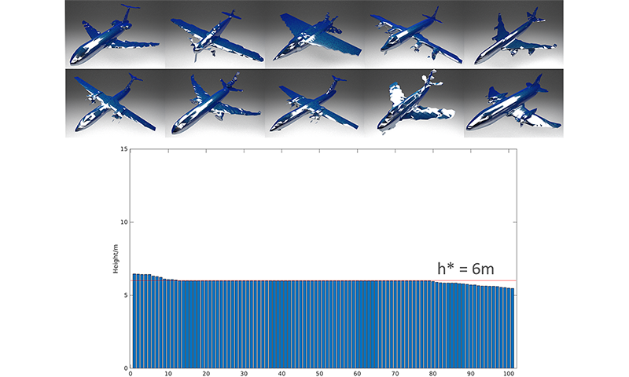
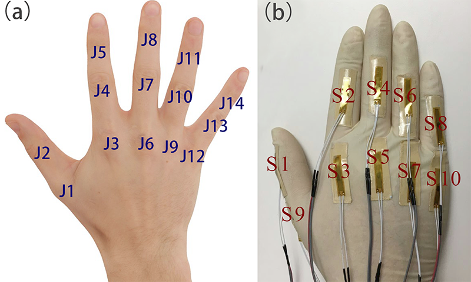

<!-- inpage jump -->
[Education](#education) &nbsp;[Research](#research)

<!-- about me -->

 
 Wentai Zhang  
 

I am a Ph.D. student at Carnegie Mellon University. My advisors are <a href="http://vdel.me.cmu.edu/" target="_blank">Prof. Levent Burak Kara</a>, <a href="http://www.andrew.cmu.edu/user/shimada/" target="_blank">Prof. Kenji Shimada</a> and <a href="http://www.cs.cmu.edu/~bapoczos/" target="_blank">Prof. Barnabas Poczos</a>.

The main focus of my research is machine learning, especially deep representation learning for 3D data, reinforcement learning and their applications in generative design and computer vision.

<!-- Education -->

<h2>Education</h2>

<table>
<tbody>
<tr>
<td colspan="3"><b>Carnegie Mellon University</b></td>
</tr>
<tr>
<td>&nbsp;Ph.D.</td>
<td>&nbsp; 3D Learning and Generative Design</td>
<td>&nbsp;   2017.08 - Present</td>
</tr>
<tr>
<td>&nbsp;M.S.</td>
<td>&nbsp; Machine Learning</td>
<td>&nbsp;   2018.09 - Present</td>
</tr>
<tr>
<td>&nbsp;M.S.</td>
<td>&nbsp; Mechnical Engineering, advisor: <a href="https://mech.rice.edu/users/higgs" target="_blank">Prof. C. Fred Higgs III</a></td>
<td>&nbsp;   2015.08 - 2017.06</td>
</tr>
<tr>
<td colspan="3"><b>Huazhong University of Science and Technology</b></td>
</tr>
<tr>
<td>&nbsp;B.S.</td>
<td>&nbsp; Mechanical Engineering</td>
<td>&nbsp;   2011.08 - 2015.06</td>
</tr>
</tbody>
</table>

<!-- Research -->

<h2>Research</h2>

 

 <a href="https://teddyz829.github.io/publications/2019fundesign">3D Shape Synthesis for Conceptual Design and Optimization Using Variational Autoencoders</a> 

<strong>Wentai Zhang</strong>, Zhangsihao Yang, Haoliang Jiang, Suyash Nigam, Soji Yamakawa, Tomotake Furuhata, Kenji Shimada, Levent Burak Kara. <em>ASME IDETC/CIE</em>, 2019.

 

 <a href="https://teddyz829.github.io/publications/2019pointcloud">Data-driven Upsampling of Point Clouds</a> 

<strong>Wentai Zhang</strong>, Haoliang Jiang*, Zhangsihao Yang*, Soji Yamakawa, Kenji Shimada, Levent Burak Kara.  <em>Computer-Aided Design</em>, 2019.

 

 

 <a href="https://teddyz829.github.io/publications/2019glove">High Degree of Freedom Hand Pose Tracking Using Limited Strain Sensing and Optical Training</a> 

<strong>Wentai Zhang</strong>, Jonelle Z. Yu, Fangcheng Zhu, Yifang Zhu, Zhangsihao Yang, Nurcan Gecer Ulu, Batuhan Arisoy, Levent Burak Kara.  <em>JCISE</em>, 2019.

<!-- Awards -->

<h2>Awards</h2>
<ul>
  <li>Best Poster and Milton Shaw PhD Student Travel Award in 2018 Graduate Research Symposium, Department of Mechanical Engineering, Carnegie Mellon University.</li>
  <li>National Scholarship (top 1%) by Ministry of Education of the People's Republic of China, 2014.</li>
</ul>

<!-- This is the front page of a website that is powered by the [academicpages template](https://github.com/academicpages/academicpages.github.io) and hosted on GitHub pages. [GitHub pages](https://pages.github.com) is a free service in which websites are built and hosted from code and data stored in a GitHub repository, automatically updating when a new commit is made to the respository. This template was forked from the [Minimal Mistakes Jekyll Theme](https://mmistakes.github.io/minimal-mistakes/) created by Michael Rose, and then extended to support the kinds of content that academics have: publications, talks, teaching, a portfolio, blog posts, and a dynamically-generated CV. You can fork [this repository](https://github.com/academicpages/academicpages.github.io) right now, modify the configuration and markdown files, add your own PDFs and other content, and have your own site for free, with no ads! An older version of this template powers my own personal website at [stuartgeiger.com](http://stuartgeiger.com), which uses [this Github repository](https://github.com/staeiou/staeiou.github.io).
A data-driven personal website
======
Like many other Jekyll-based GitHub Pages templates, academicpages makes you separate the website's content from its form. The content & metadata of your website are in structured markdown files, while various other files constitute the theme, specifying how to transform that content & metadata into HTML pages. You keep these various markdown (.md), YAML (.yml), HTML, and CSS files in a public GitHub repository. Each time you commit and push an update to the repository, the [GitHub pages](https://pages.github.com/) service creates static HTML pages based on these files, which are hosted on GitHub's servers free of charge.
Many of the features of dynamic content management systems (like Wordpress) can be achieved in this fashion, using a fraction of the computational resources and with far less vulnerability to hacking and DDoSing. You can also modify the theme to your heart's content without touching the content of your site. If you get to a point where you've broken something in Jekyll/HTML/CSS beyond repair, your markdown files describing your talks, publications, etc. are safe. You can rollback the changes or even delete the repository and start over -- just be sure to save the markdown files! Finally, you can also write scripts that process the structured data on the site, such as [this one](https://github.com/academicpages/academicpages.github.io/blob/master/talkmap.ipynb) that analyzes metadata in pages about talks to display [a map of every location you've given a talk](https://academicpages.github.io/talkmap.html).
Getting started
======
1. Register a GitHub account if you don't have one and confirm your e-mail (required!)
2. Fork [this repository](https://github.com/academicpages/academicpages.github.io) by clicking the "fork" button in the top right. 
3. Go to the repository's settings (rightmost item in the tabs that start with "Code", should be below "Unwatch"). Rename the repository "[your GitHub username].github.io", which will also be your website's URL.
4. Set site-wide configuration and create content & metadata (see below -- also see [this set of diffs](http://archive.is/3TPas) showing what files were changed to set up [an example site](https://getorg-testacct.github.io) for a user with the username "getorg-testacct")
5. Upload any files (like PDFs, .zip files, etc.) to the files/ directory. They will appear at https://[your GitHub username].github.io/files/example.pdf.  
6. Check status by going to the repository settings, in the "GitHub pages" section
Site-wide configuration
------
The main configuration file for the site is in the base directory in [_config.yml](https://github.com/academicpages/academicpages.github.io/blob/master/_config.yml), which defines the content in the sidebars and other site-wide features. You will need to replace the default variables with ones about yourself and your site's github repository. The configuration file for the top menu is in [_data/navigation.yml](https://github.com/academicpages/academicpages.github.io/blob/master/_data/navigation.yml). For example, if you don't have a portfolio or blog posts, you can remove those items from that navigation.yml file to remove them from the header. 
Create content & metadata
------
For site content, there is one markdown file for each type of content, which are stored in directories like _publications, _talks, _posts, _teaching, or _pages. For example, each talk is a markdown file in the [_talks directory](https://github.com/academicpages/academicpages.github.io/tree/master/_talks). At the top of each markdown file is structured data in YAML about the talk, which the theme will parse to do lots of cool stuff. The same structured data about a talk is used to generate the list of talks on the [Talks page](https://academicpages.github.io/talks), each [individual page](https://academicpages.github.io/talks/2012-03-01-talk-1) for specific talks, the talks section for the [CV page](https://academicpages.github.io/cv), and the [map of places you've given a talk](https://academicpages.github.io/talkmap.html) (if you run this [python file](https://github.com/academicpages/academicpages.github.io/blob/master/talkmap.py) or [Jupyter notebook](https://github.com/academicpages/academicpages.github.io/blob/master/talkmap.ipynb), which creates the HTML for the map based on the contents of the _talks directory).
**Markdown generator**
I have also created [a set of Jupyter notebooks](https://github.com/academicpages/academicpages.github.io/tree/master/markdown_generator
) that converts a CSV containing structured data about talks or presentations into individual markdown files that will be properly formatted for the academicpages template. The sample CSVs in that directory are the ones I used to create my own personal website at stuartgeiger.com. My usual workflow is that I keep a spreadsheet of my publications and talks, then run the code in these notebooks to generate the markdown files, then commit and push them to the GitHub repository.
How to edit your site's GitHub repository
------
Many people use a git client to create files on their local computer and then push them to GitHub's servers. If you are not familiar with git, you can directly edit these configuration and markdown files directly in the github.com interface. Navigate to a file (like [this one](https://github.com/academicpages/academicpages.github.io/blob/master/_talks/2012-03-01-talk-1.md) and click the pencil icon in the top right of the content preview (to the right of the "Raw | Blame | History" buttons). You can delete a file by clicking the trashcan icon to the right of the pencil icon. You can also create new files or upload files by navigating to a directory and clicking the "Create new file" or "Upload files" buttons. 
Example: editing a markdown file for a talk

For more info
------
More info about configuring academicpages can be found in [the guide](https://academicpages.github.io/markdown/). The [guides for the Minimal Mistakes theme](https://mmistakes.github.io/minimal-mistakes/docs/configuration/) (which this theme was forked from) might also be helpful. -->
