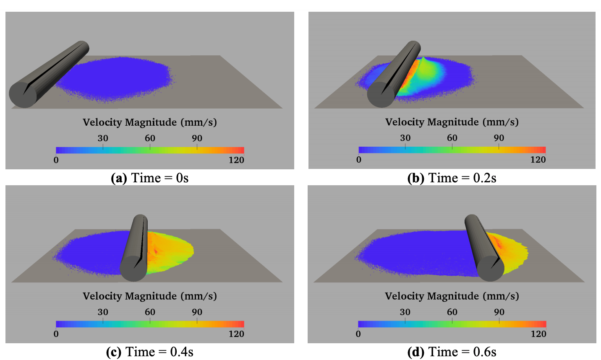

 

 <a href="./../publications/2019fundesign.html">3D Shape Synthesis for Conceptual Design and Optimization Using Variational Autoencoders</a> 

<strong>Wentai Zhang</strong>, Zhangsihao Yang, Haoliang Jiang, Suyash Nigam, Soji Yamakawa, Tomotake Furuhata, Kenji Shimada, Levent Burak Kara. <em>ASME IDETC/CIE</em>, 2019.

 

 <a href="./../publications/2019pointcloud.html">Data-driven Upsampling of Point Clouds</a> 

<strong>Wentai Zhang</strong>, Haoliang Jiang*, Zhangsihao Yang*, Soji Yamakawa, Kenji Shimada, Levent Burak Kara.  <em>Computer-Aided Design</em>, 2019.

 

 

 <a href="./../publications/2019glove.html">High Degree of Freedom Hand Pose Tracking Using Limited Strain Sensing and Optical Training</a> 

<strong>Wentai Zhang</strong>, Jonelle Z. Yu, Fangcheng Zhu, Yifang Zhu, Zhangsihao Yang, Nurcan Gecer Ulu, Batuhan Arisoy, Levent Burak Kara.  <em>JCISE</em>, 2018.

 

 <a href="./../publications/2017am.html">Machine learning enabled powder spreading process map for metal additive manufacturing (AM)</a> 

<strong>Wentai Zhang</strong>, Akash Mehta, Prathamesh S Desai, C. Fred Higgs III.  <em>The 28th Annual International Solid Freeform Fabrication Symposium</em>, 2017.

 

<!-- Project -->

 <h1>Project</h1>
 

 <!-- 703 proj -->
 

 <h3><u>Robotic Arm Control Using Deep Reinforcement Learning with Gaussian Extrinsic Rewards</u></h3>
 
<strong>Wentai Zhang</strong>, Bolun Dai, Zhangsihao Yang. Fall, 2018. <a href="./../files/2018robot.pdf" target="_blank">PDF</a>  Instructors: <a href="https://www.cs.cmu.edu/~katef/" target="_blank">Katerina Fragkiadaki</a> and <a href="http://www.cs.cmu.edu/~tom/" target="_blank">Tom Mitchell</a>.

 

 <!-- 707 proj -->
 

 <h3>TD-GAN for Chatbot Text Generation</h3>
 
Yu Huang, <strong>Wentai Zhang</strong>, Yunwen Zhou. Fall, 2017. <a href="./../files/2017tdgan.pdf" target="_blank">PDF</a>  Instructor: <a href="http://www.cs.cmu.edu/~rsalakhu/" target="_blank">Ruslan Salakhutdinov</a>.

 

* <em>Equal contributions.</em>
