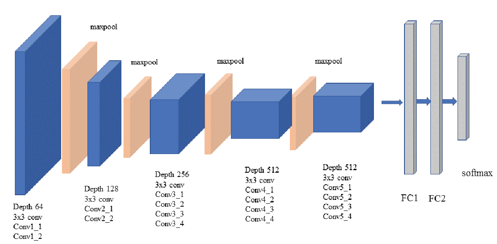

<div align="center">
	<h2>16-726 Learning-Based Image Synthesis, 2021 Spring</h2>
	<h4>Project 4: Neural Style Transfer</h4>
	<h5>Teddy Zhang (wentaiz)</h5>
	
</div>

<!-- ##16-726 Learning-Based Image Synthesis, 2021 Spring
### Project 1: Colorizing the Prokudin-Gorskii Photo Collection
##### Name: Teddy Zhang, Andrew ID: wentaiz -->
---
<div align="center">
	<center>
</div>

#### Overview
Neural-Style, or Neural-Transfer, allows us to take an image and reproduce it with a new artistic style. The algorithm takes three images, an input image, a content-image, and a style-image, and changes the input to resemble the content of the content-image and the artistic style of the style-image.

The principle is simple: we define two distances, one for the content ($D_C$) and one for the style ($D_S$). $D_C$ measures how different the content is between two images while $D_S$ measures how different the style is between two images. Then, we take a third image, the input, and transform it to minimize both its content-distance with the content-image and its style-distance with the style-image. Now we can import the necessary packages and begin the neural transfer.

#### Content Reconstruction
In this part, we are trying to optimize a noise input so that the content loss is minimized. Here we use a pre-trained VGG19 network to extract the features from the target image at different levels. The main purpose here is to identify the most proper level to measure the content distance.

The structure of a VGG 19 network is shown in the figure below:
<div align="center">
	
</div>


Some details of my implementation are:
- **Content Loss** 
  - MSE: $D_C=|f_X^L-f_C^L|^2$, where $f_X^L$ and $f_C^L$ are $L$th-layer feature from VGG19 of the input image $X$ and content image $C$. 
- **Optimizer**
  - L-BFGS, a popular quasi-Newton method available in _pytorch_.
- **Hyperparameters**
  - Layers to be checked: Layer1 to Layer9 (Conv1_1 to Conv4_1 in the image above)
  - Number of steps: 300

We ran the optimization on two given images: _fallingwater.png_ and _wally.png_. Here are the obtained optimized input image at different levels:

<div align="center">
	
  <figcaption>Fig.1 Optimized input image from convolutional layer 1 to 9 of the falling water image.</figcaption>
</div>

<div align="center">
	
  <figcaption>Fig.2 Optimized input image from convolutional layer 1 to 9 of the wally image.</figcaption>
</div>

From Conv1 to Conv3, the optimized input is visually the same as the original image except for some ignorable noise. But the quality of the reconstraction decreases evidently since Conv4 in both cases. The main purpose here is to find a layer that preserve as much essential contents with a relatively small size. So we select Conv3 as the layer to calculate the content loss.

To inspect the stability of the optimizer on this problem, we also tried two different initializations of the input noise image. The obtained results are shown below:

<div align="center">
	
  <figcaption>Fig.3 Left: Original image, Middle: Reconstruction from noise 1, Right: Reconstruction from noise 2.</figcaption>
</div>

We can hardly tell the difference between the reconstructions out of different input noise. This means that the chosen content loss at Conv3 layer can be stably optimized with LBFGS optimizer.


#### Texture Synthesis

In this part, we focus more on the capturing the style/texture information from the given style image. In a similar manner, we still utilize the pretrained VGG 19 network for feature extraction. But here the style loss is defined differently.

Some details of my implementation are:
- **Style Loss** 
  - MSE: $D_S=|G_X^L-G_S^L|^2$, where $G_X^L=f_X^L(f_X^L)^T$ and $G_S^L=f_S^L(f_S^L)^T$ are gram matrices calculated from $L$th-layer feature of the input image $X$ and style image $S$. 
- **Optimizer**
  - L-BFGS, a popular quasi-Newton method available in _pytorch_.
- **Hyperparameters**
  - Layers to be checked: Layer1 to Layer9 (Conv1_1 to Conv4_1 in the image above)
  - Number of steps: 300

We ran the optimization on two given images: _frida_kahlo.jpeg_ and _the_scream.jpeg_. Here are the obtained optimized input image at different levels:

<div align="center">
	
  <figcaption>Fig.4 (1): the original frida kahlo image, (2)-(10): optimized input from layer 1 to 9 seperately, (11)-(15) optimized input from layer1 to 2, layer1 to 3, layer1 to 4, layer1 to 5 and layer1 to 6.</figcaption>
</div>

<div align="center">
	
  <figcaption>Fig.5 (1): the original scream image, (2)-(10): optimized input from layer 1 to 9 seperately, (11)-(15) optimized input from layer1 to 2, layer1 to 3, layer1 to 4, layer1 to 5 and layer1 to 6.</figcaption>
</div>

We can tell from the (2)-(10) in Fig 4 and Fig 5 that the obtained texture is more coarse as we reach deeper layers. From visual inspection, we select Conv1 to 6 as the target layers to extract the style features. To further identify a good combination of these layers, we also generated optimized images from different combinations of the proposed layers, see (11)-(15) in each figure. We select to combine from conv1 to conv5 because it captures proper texture features among all the combinations.

Similarly, we also tried two different initializations of the input noise image. The obtained results are shown below:

<div align="center">
	
  <figcaption>Fig.6 Left: Original image, Middle: Reconstruction from noise 1, Right: Reconstruction from noise 2.</figcaption>
</div>

Here, two resulting input images generated from different initializations are not exactly the same. But they both preserve very similar textures.


#### Style Transfer
In this part, we are trying to combine the two losses introduced in the previous two sections to achieve the neural style transfer. Here the total loss is defined as: $L_{total} = w_{style}\times L_{style}+1\times L_{content}$. 

##### Parameter Search

Since the total loss is a weighted average. A critical parameter in this optimization process is the style weight. It should be different from case to case when using various image pairs. Here, we demonstrate a example for this parameter search.


<div align="center">
	
  <figcaption>Fig.7 Case 1 conditon: style image: frida, content image: fallingwater.</figcaption>
</div>

<div align="center">
	
  <figcaption>Fig.8 Case 1 results with style weight ranging from 1, 10, 100, 1000, 10000, 30000 and 100000.</figcaption>
</div>

From the example above, we first run the optimization with style weights from 1 to 100000. When the style weight is small, the obtained image looks fairly similar to the content image. As the weight increases, more and more textures are added to the resulting image. However, the content information will be hardly recognizable when the style loss is dominant. Here, we can tell that the proper weight falls within the range of 10000 to 100000. Then use 30000 and generate the final result.

<div align="center">
	
  <figcaption>Fig.9 Case 2 conditon: style image: frida, content image: fallingwater.</figcaption>
</div>

<div align="center">
	
  <figcaption>Fig.10 Case 2 results with style weight ranging from 1, 10, 100, 1000, 10000, 70000 and 100000.</figcaption>
</div>

Similarly, another case is demonstrated above. We eventually use 70000 and generate the final result.

##### Input Image: Noise vs Content image 

Instead of taking a noise image as the input, we can also take the content image as the inital value for the input image. To evaluate the effect of using the content image, we ran the style transfer in both scenarios. Here are the comparisons:

<div align="center">
	
  <figcaption>Fig.11 Comparisons between obtained images from noise input and content input. In each row, the style image, content image, result from noise input and result from content input are shown.</figcaption>
</div>

| Cases | Runtime(s) | Optimization Success Rate | 
| :--- | :----: | :----: |
| Case 1 with noise input | $13.46$ | $3/3$ |
| Case 1 with content input   | $13.75$      | $3/3$     |
| Case 2 with noise input | $13.68$ | $3/3$ |
| Case 2 with content input   | $13.64$      | $3/3$    |
| Case 3 with noise input | $13.37$ | $1/3$ |
| Case 3 with content input   | $13.45$      | $3/3$     |

From Fig. 11, we can tell that the reulting image aligns better with the content image while still preserving good texture features. Using the same number of steps, two methods are comparable in terms of runtime. But in some hard cases (like case 3), the rate of getting a reaching a good optima is lower when using the noise image as input.

##### Grid of Results

As a way to verify our implementation, we also test the style transfer algorithm from 4 given content images mixing with 3 style images accordingly. 

<div align="center">
	
  <figcaption>Fig.12 </figcaption>
</div>

##### Freestyle

Here are more results using images from web or my personal photo album. In each row, the style image, the content image and the final result are demonstrated.

```
The content images from row 2 to 6 are all from my personal album. All rights reserved.
```

<div align="center">
	
  <figcaption>Fig.13 </figcaption>
</div>


---
<span id="mixed"></span>

#### Bells & Whistles: Style Transfer for Grumpy Cats
Here are the results when I use some images from project 2 (possion blend) and project 3 (grumpy cats):

<div align="center">
	
  <figcaption>Fig.14 </figcaption>
</div>

Personally, I really love the results generated from one piece style. 


---
#### Acknowledgement

- The basic methods are inspired by [CMU 16-726](https://learning-image-synthesis.github.io/assignments/hw4) and [Pytorch tutorial neural transfer](https://pytorch.org/tutorials/advanced/neural_style_tutorial.html).
